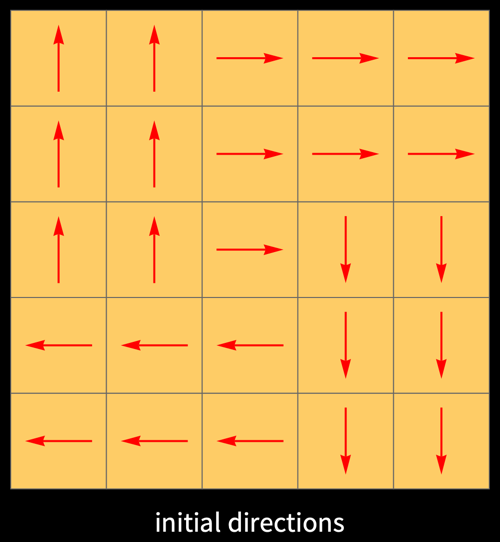
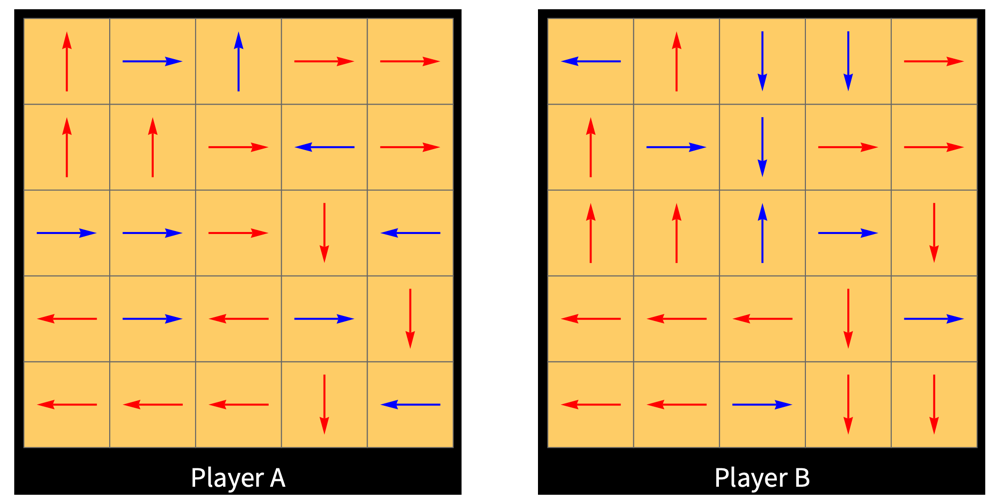

# Counterfeit Compass

*Counterfeit Compass* is a two-player game of incomplete information in which bluffing is possible, but risky: a challenged claim must be backed by a ZK proof, and verification failure is fatal.

Both players start with zero *charge*, which increases or decreases as they take turns moving on a 5×5 board according to precise rules.

**Objective:** the first player to reach a charge of 7 wins.

## Game description and setup

Both players begin with the same initial field of directions (`N`, `E`, `S`, and `W`) on a 5×5 square grid.

A marker on each player's grid indicates that player's current position.

Setup:

- both players start at the center;
- both players start with charge 0;
- both players begin from the same initial grid and may modify up to 9 cells.

The game starts after both players confirm their modified cells.  Each grid remains fixed for the duration of the game. Each player can see only their own grid.

Example: each player has chosen a grid of directions (modified directions shown in blue):

## Position and dominant direction

A player's position determines a *dominant direction*, defined as the most frequent direction among the arrows immediately above, to the right, below, and to the left of the player's current position.

If there is a tie among these four arrows, the *dominant direction* is the direction of the arrow at the player's current position.

The *dominant direction* of one player determines the movement of the other player, as explained below.

## Movement and charge

Charge changes as players move across the grid.

1. Players take turns moving, and each move consists of exactly one square up, right, down, or left; that is, one of `N`, `E`, `S`, or `W`.

2. The player whose turn it is to move, say Player A, requests a *reading* of the **dominant direction** associated with Player B's current position, as defined above. This reading determines the direction in which Player A must move.

   Note that Player B is not required to tell the truth about the *dominant direction* at their current position.

3. After moving, Player A's *charge* may increase or decrease as follows. Let `M` denote Player A's direction of movement, and let `D` denote the direction of the arrow on the destination square.

   Player A's charge:

   * increases by 2 if `D` coincides with `M`;
   * increases by 1 if `D` is 90 degrees clockwise from `M`;
   * decreases by 1 if `D` is opposite to `M`;
   * remains unchanged if `D` is 90 degrees counterclockwise from `M`.

As stated above, **the first player to reach a charge of 7 wins**.

4. Before Player A makes the move indicated by Player B's reading, Player A may challenge Player B's reading. In that case, Player B must submit a *ZK proof* attesting that the reading is correct. If verification of Player B's proof:

   * fails, or no proof is submitted, then Player A wins the game;
   * succeeds, then Player A loses 2 units of charge.

5. Movement at the **board edges** follows the *Pac-Man* (or *toroidal*) convention: if a player is at the top edge of the board, then moving up (`N`) places the player at the bottom of the same column, and similarly for the other three edges.

   The same convention is used to determine the *dominant direction*. For example, if a player is at the top edge, then the arrow "above" is the arrow at the bottom of the same column.